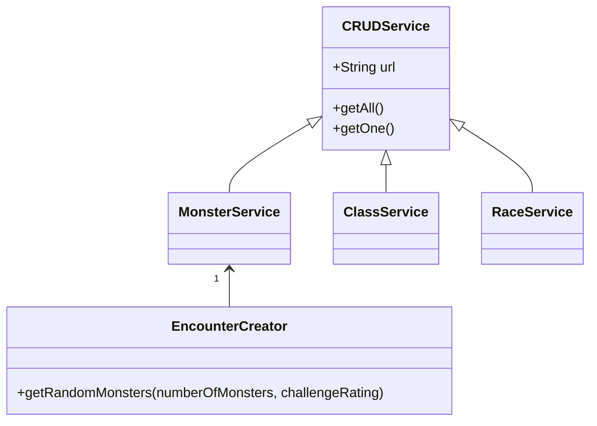

```mermaid
    classDiagram
        CRUDService <|-- MonsterService
        CRUDService <|-- ClassService
        CRUDService <|-- RaceService

        MonsterService"1"<--EncounterCreator


        class CRUDService{
            +String url
            +getAll()
            +getOne()
        }

        class EncounterCreator{
            +getRandomMonsters(numberOfMonsters, challengeRating)
        }

```