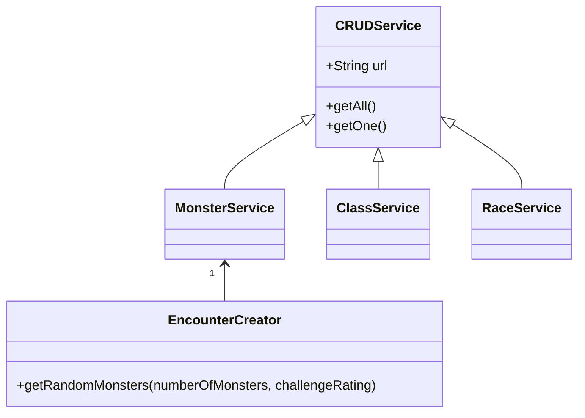

# DND api helper module
```
npm i dnd_api_helper
```
This module sends several requests to an [dnd5e api](http://www.dnd5eapi.co/docs/#overview).
The reason this module exists is to provide a simplified interface for developers to interact with chosen parts of the mentioned api. It is not meant to replace the already existing api unless the developer using this module is planning on creating a super simple dnd application.
### Example usage
```js
import { EncounterCreator } from 'dnd_api_helper'

const encounterCreator = new EncounterCreator()

const monsters = await encounterCreator.getRandomMonsters(3)

console.log(monsters)
```

### Classes
> Not all classes are available to use with installed module

#### EncounterCreator
getRandomMonsters(@Optional numberOfMonsters: number, @Optional challengeRating: number). This method fetches all monsters with the desired challenge rating(if any has been specified) and picks one or more random monsters from the retrieved list.
